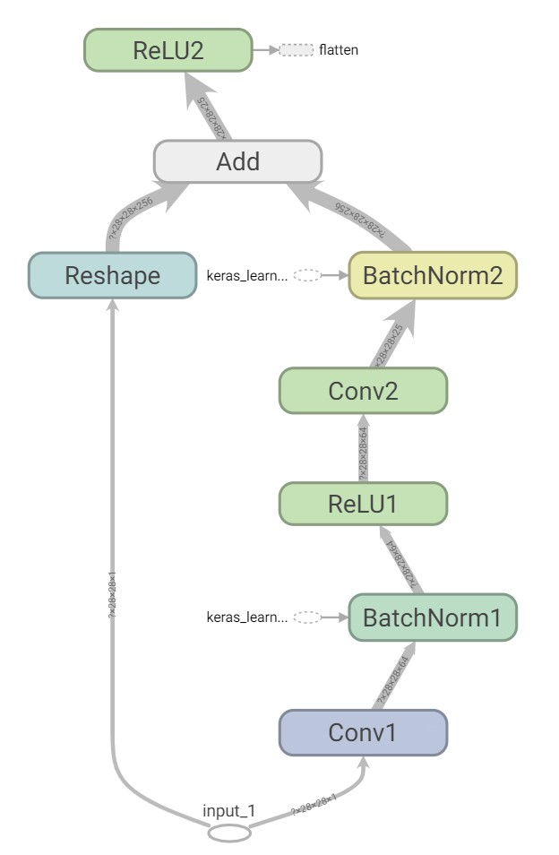
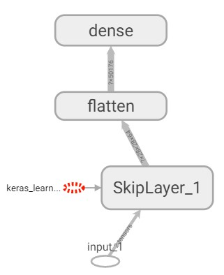

# AutoCNN

<p align="center">
    <a href="https://github.com/Marius-Juston/AutoCNN/graphs/contributors" alt="Contributors">
        </a>
    <a href="https://github.com/Marius-Juston/AutoCNN/pulse" alt="Activity">
        </a>
    <a href="https://github.com/Marius-Juston/AutoCNN/stargazers">
        </a>
    <a href="https://github.com/Marius-Juston/AutoCNN/network/members">
        </a>
    <a href="https://github.com/Marius-Juston/AutoCNN/issues">
        </a>
    <a href="./LICENSE" alt="Activity">
        </a>
</p>


This project is an implementation of the paper ["Automatically Designing CNN Architectures Using
Genetic Algorithm for Image Classification"](https://paperswithcode.com/paper/automatically-designing-cnn-architectures) 

## How it works

This is an algorithm that is able to full automatically find an optimal CNN (Convolutional Neural Network) architecture.

There are two main building blocks to this algorithm:
### Skip Layer




Each Skip Layer comprises of:

The input first passes through:
1. A convolution layer
2. A batch normalization
3. A ReLU activation layer
4. Another convolution layer
5. Another batch normalization layer

(all of the convolution layers have a kernel size of 3x3 and a stride of 1x1, the filter size is randomly chosen as a power of 2)

The input also passes through a convolution of kernel and stride size 1x1 with a filter size being the same as the last convolution.
This "reshapes" the input in order to allow for element wise adding

The two outputs are combined in an add operation and then passed through a ReLU activation function

### Pooling Layer

This is either a Max Pooling or a Average Pooling layer, the kernel and the stride size are 2x2

### Layers

| Layer Type         | Layer Documentation                                                                                                 |
| :----------------: | :-----------------------------------------------------------------------------------------------------------------: |
| Convolution        | [tf.keras.layers.Conv2D](https://www.tensorflow.org/api_docs/python/tf/keras/layers/Conv2D)                         |
| MaxPooling         | [tf.keras.layers.MaxPool2D](https://www.tensorflow.org/api_docs/python/tf/keras/layers/MaxPool2D)                   |
| AveragePooling     | [tf.keras.layers.AveragePooling2D](https://www.tensorflow.org/api_docs/python/tf/keras/layers/AveragePooling2D)     |
| Activation         | [tf.keras.layers.Activation](https://www.tensorflow.org/api_docs/python/tf/keras/layers/Activation)                 |
| Add                | [tf.keras.layers.add](https://www.tensorflow.org/api_docs/python/tf/keras/layers/add)                               |
| BatchNormalization | [tf.keras.layers.BatchNormalization](https://www.tensorflow.org/api_docs/python/tf/keras/layers/BatchNormalization) |

### Steps
To do this the algorithm follows these steps:

1. Create an random initial population
2. Evaluate the fitness of the population by training the CNN
3. Generating offsprings
    - 2 different CNN in the population are selected using a [Binary Tournament Selection](https://en.wikipedia.org/wiki/Tournament_selection) method
    - Given a certain probability a crossover between the two parents might happen
        - the two CNNs are split into two and two new CNN are created by mixing the parent "genes"
    -After all the new offsprings are created go through each of them and given a certain probability mutate the offspring
        - a mutation are:
            - add a skip layer: increases the complexity and depth of the network
            - add a pooling layer: increases the depth but might decrease the complexity due to the nature of pooling
            - remove a layer: reduce complexity and depth
            - randomize a layer: changes the parameters of a layer (i.e filter size, max or mean pooling)
4. Evaluate the offspring fitness
5. From the offsprings and the parent population generate a new population
    - Until N CNN have been selected:
        - randomly select 2 CNN, add the one with the highest fitness to the list
    - Look at if the CNN from the offspring and parent population was placed in the new population
        - if it is not replace the worst CNN by the best
6. Repeat step 2. 

### Installation

```shell script
pip install auto-cnn
```

### Example

```python
import os

os.environ['TF_CPP_MIN_LOG_LEVEL'] = '3' # Removes Tensorflow debuggin ouputs

import tensorflow as tf

tf.get_logger().setLevel('INFO') # Removes Tensorflow debugging ouputs

from auto_cnn.gan import AutoCNN

import random

# Sets the random seeds to make testing more consisent
random.seed(42)
tf.random.set_seed(42)


def mnist_test():
    # Loads the data as test and train 
    (x_train, y_train), (x_test, y_test) = tf.keras.datasets.mnist.load_data()

    # Puts the data in a dictionary for the algorithm to use  
    data = {'x_train': x_train, 'y_train': y_train, 'x_test': x_test, 'y_test': y_test}

    # Sets the wanted parameters  
    a = AutoCNN(population_size=5, maximal_generation_number=4, dataset=data, epoch_number=5)
    
    # Runs the algorithm until the maximal_generation_number has been reached
    best_cnn = a.run()
    print(best_cnn)

if __name__ == '__main__':
    mnist_test()
```

Given these parameters the structure that was chosen was this:



CNN: 128-64

Score (Test Accuracy): 0.9799000024795532

## Contributing

If you have any idea on improving the performance, adding more customizations or correcting mistakes, please make a pull request or create an issue. I'd be happy to accept any contributions!
